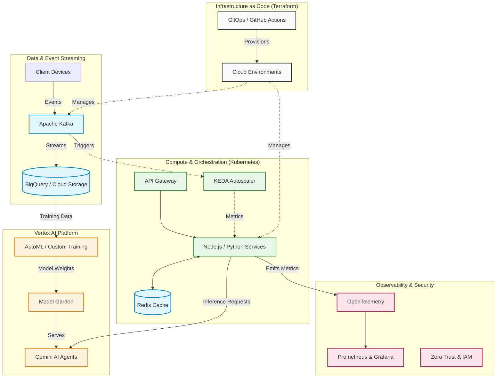

# Zain Ahmed

**Cloud & Platform Engineer | Distributed Systems & Automation**

[LinkedIn](https://linkedin.com/in/thezainahmed) | [Portfolio](https://zainahmed.net) | [Microsoft Learn](https://learn.microsoft.com/en-us/users/thezainahmed/) | [Email](mailto:zain.ahm3d@outlook.com)

I am a certified DevOps engineer focused on designing scalable cloud setups across AWS, Azure, and GCP. I spend a lot of time automating CI/CD pipelines to keep things running smoothly. So far, I have been able to cut deployment failures by 75 percent and speed up release cycles from a matter of days to just a few hours. I rely heavily on tools like Terraform and Kubernetes to keep systems observable and reliable. I also work as a full stack developer. This helps me bridge the gap between building software and actually running it in production. My main goal is always to deliver solid, high performance applications that can scale.

## Core Engineering Domains

### Cloud Infrastructure & Orchestration
My primary focus is on building resilient platforms using modern cloud native primitives.
* **Platforms:** GCP (Primary), AWS, Azure, Oracle Cloud
* **Containerization & Kubernetes:** Docker, Kubernetes, Managed Clusters (GKE, EKS, AKS, OKE), KEDA 
* **Infrastructure as Code:** Terraform, GCP Deployment Manager, AWS CDK, CloudFormation
* **CI/CD:** GitHub Actions, GitLab CI, Jenkins, Cloud Build

### Backend Systems & Observability
I design systems that are highly available and easy to monitor.
* **Languages & Runtimes:** Node.js, Python, TypeScript
* **Databases & Caching:** PostgreSQL, MySQL, MongoDB, Redis, DynamoDB
* **Messaging & Streaming:** Apache Kafka, Google Cloud Pub/Sub, AWS Kinesis
* **Observability:** Google Cloud Operations Suite, CloudWatch, Prometheus, Grafana, OpenTelemetry

### AI Integration & Vertex AI
I integrate machine learning capabilities into production systems securely and efficiently.
* **Vertex AI & Gemini:** Leveraging Google Cloud's unified ML platform for enterprise AI agents. I work with Model Garden, Vertex AI Studio, and AutoML for custom training and orchestrating complex reasoning workflows.
* **API Integration:** OpenAI, Anthropic, Google AI
* **Applied AI:** Intelligent chatbots, automated data processing pipelines, predictive analytics

## System Architecture Overview

Here is a high level look at how I typically design scalable, event driven cloud architectures that integrate machine learning.

## Engineering Philosophy

* **Infrastructure as Code:** Everything from networks to monitoring dashboards should be version controlled.
* **Observability first:** If you cannot measure it, you cannot manage it. I instrument early and often.
* **Security by design:** Implementing zero trust principles, IAM least privilege, and automated compliance checks.
* **Developer velocity:** Building internal developer platforms that reduce cognitive load and speed up shipping.

## Certifications & Achievements

* **Google Cloud Certified: Associate Cloud Engineer** (In Progress)
* [**AWS Certified DevOps Engineer (Professional)**](https://www.credly.com/badges/9906ccb7-1339-4eb9-b714-2c6cbcd56954)
* [**AWS Certified Solutions Architect (Associate)**](https://www.credly.com/badges/e07463a6-2d96-4cf0-9938-8e1b9e98aba9/)
* [**Microsoft Certified: Azure Administrator Associate (AZ-104)**](https://learn.microsoft.com/en-us/users/thezainahmed/credentials/2b4e57ea7bfdb97f?ref=https%3A%2F%2Fwww.linkedin.com%2F)
* [**Oracle Cloud Infrastructure 2025 Certified DevOps Professional**](https://catalog-education.oracle.com/ords/certview/sharebadge?id=066828C64B2A78C45B111478C769FE1F6C8AF57B654ACA771B72E7912DE0A57E)
* **Kubernetes Administrator (CKA)** (Planned)
* **National First Runner Up (Contest-Azm 2020 Mobile App Development)**
* **99.9% uptime** engineered for a cloud native LMS application supporting thousands of users

## Analytics

  
  
    
  
    
  
    
  

